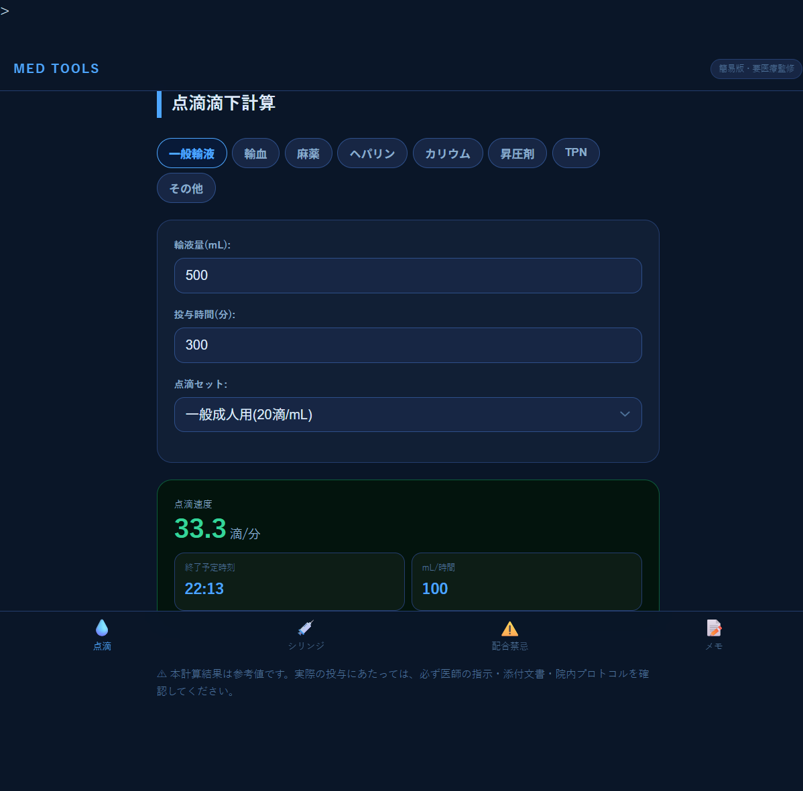
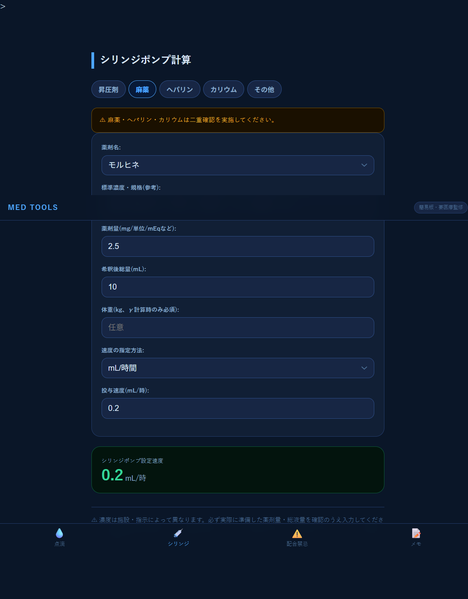
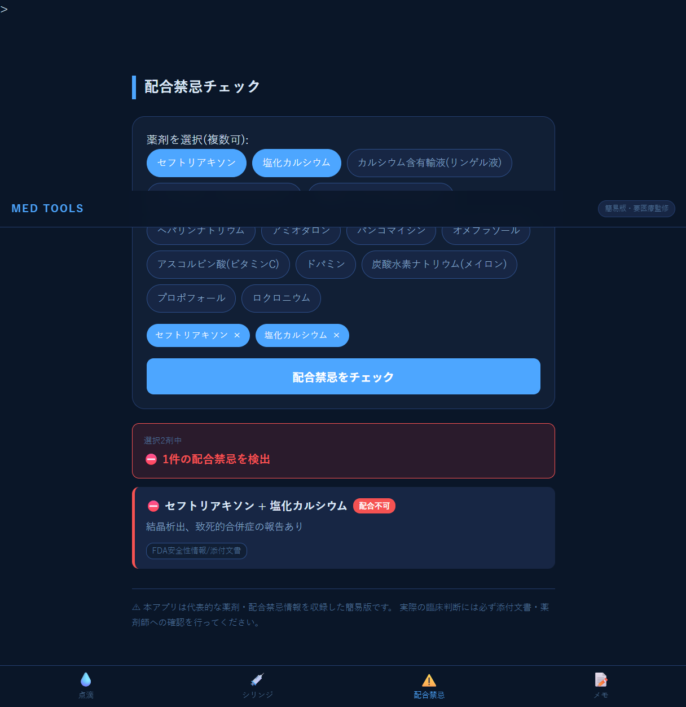
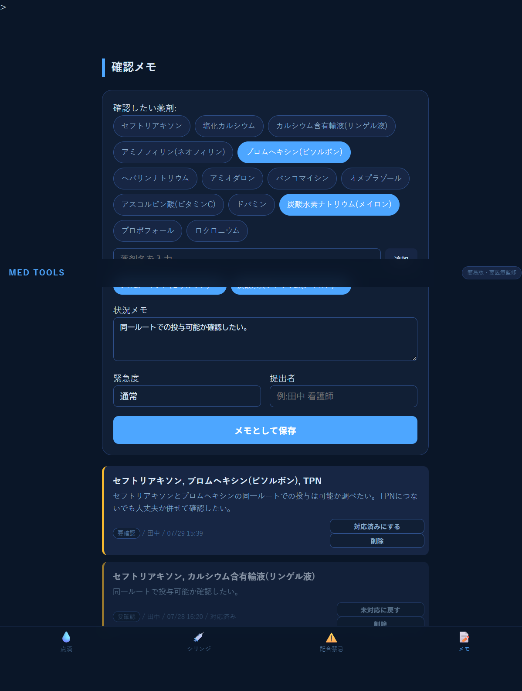

# IncompatibilityChecker(配合禁忌チェッカー)

看護師としての臨床経験をもとに、**点滴滴下計算・シリンジポンプ計算・配合禁忌チェック・確認メモ**の4機能を統合した医療系Webアプリです。就職活動用のポートフォリオとして、Servlet/JSP(MVC構成)+ JavaScript + MySQLで開発しました。

> ⚠️ 本アプリは代表的な薬剤・配合禁忌情報を収録した簡易版です。実際の臨床判断には必ず添付文書・薬剤師への確認を行ってください。

---

## 🩺 開発の背景

看護師として約10年間勤務する中で、慢性的な人手不足に加え、診療報酬改定のたびに増加する業務負担を、どうにか軽減できないかと考え続けてきました。また、看護師間で経験値や知識量に差があることも実感しており、特に配合禁忌の確認や点滴・シリンジポンプの計算といった、正確性が求められる業務において、知識不足による調査時間の発生や、あいまいな知識のまま対応してしまうリスクをどう減らせるかが課題でした。

現在は医療IT分野へのキャリアチェンジを目指し、職業訓練校でJava/Pythonを学んでいます。その中で、臨床現場での実体験と、新たに身につけた開発スキルを掛け合わせた成果物として、本アプリを開発しました。

---

## ✨ 主な機能

### 💧 点滴滴下計算
一般輸液・輸血・麻薬・ヘパリン・カリウム・昇圧剤・TPN・その他の8カテゴリに対応。輸液量と投与時間から滴下数・mL/時・終了予定時刻を即座に計算します。カリウムは20mEq/時の上限を超えると警告表示、輸血は開始/維持の2段階速度と副作用観察のタイミングを表示します。

### 💉 シリンジポンプ計算
昇圧剤・麻薬・ヘパリン・カリウム・その他の5カテゴリに対応。mL/時・μg/kg/分・μg/kg/時間・単位/時など、複数の速度指定方法を切り替えて計算できます。

### ⚠️ 配合禁忌チェック
14薬剤・8配合禁忌パターンを収録。薬剤をチップ形式で複数選択すると、全組み合わせを一括判定し、危険度(配合不可/要注意)・理由・出典を即座に表示します。

### 📝 確認メモ
「この組み合わせ、後で確認したい」という現場でのちょっとした気づきを記録できる機能です。緊急度(通常・要確認・緊急)、提出者、対応状況(未対応/対応済み)を管理できます。

---

## 🛠️ 技術構成

| 分類 | 使用技術 |
|---|---|
| バックエンド | Java 21, Servlet, JSP(JSTL) |
| データベース | MySQL 8.0 |
| フロントエンド | HTML / CSS / JavaScript(バニラJS) |
| 開発環境 | Eclipse IDE, Apache Tomcat 11 |

---

## 📐 設計のポイント

### サーバーサイドとクライアントサイドの使い分け
配合禁忌データやメモのように**永続化(DB保存)が必要な機能**はServlet/JSP + MySQLで、点滴・シリンジ・配合禁忌判定のように**即時性が求められる計算**はJavaScriptで処理する、というハイブリッド構成にしています。

### 操作性を優先した設計変更
配合禁忌チェックは、当初「薬剤選択画面 → サーバーへPOST送信 → 別ページで結果表示」というページ遷移方式で実装していましたが、実際に使ってみると操作にワンテンポの待ち時間があり、現場での使いやすさに欠けると感じました。そこで、薬剤データをページ読込時にJavaScript側へ渡し、選択から判定までを1画面で完結させる方式に設計を変更しました。

### セキュリティへの配慮
メモ機能はユーザーが自由に入力したテキストをそのまま画面に表示する仕様のため、XSS(クロスサイトスクリプティング)対策として、JSTLの`<c:out>`タグによる自動エスケープ処理を実装しています。

---

## 📸 スクリーンショット

| 点滴滴下計算 | シリンジポンプ計算 |
|---|---|
|  |  |

| 配合禁忌チェック | 確認メモ |
|---|---|
|  |  |

---

## 🚀 今後の展望

- クラウド環境へのデプロイ(現在はローカル環境での動作を想定)
- 配合禁忌データの拡充
- レスポンシブ対応の強化

---

## 👤 作成者

はるな(看護師 / 医療IT分野へのキャリアチェンジを目指して学習中)
